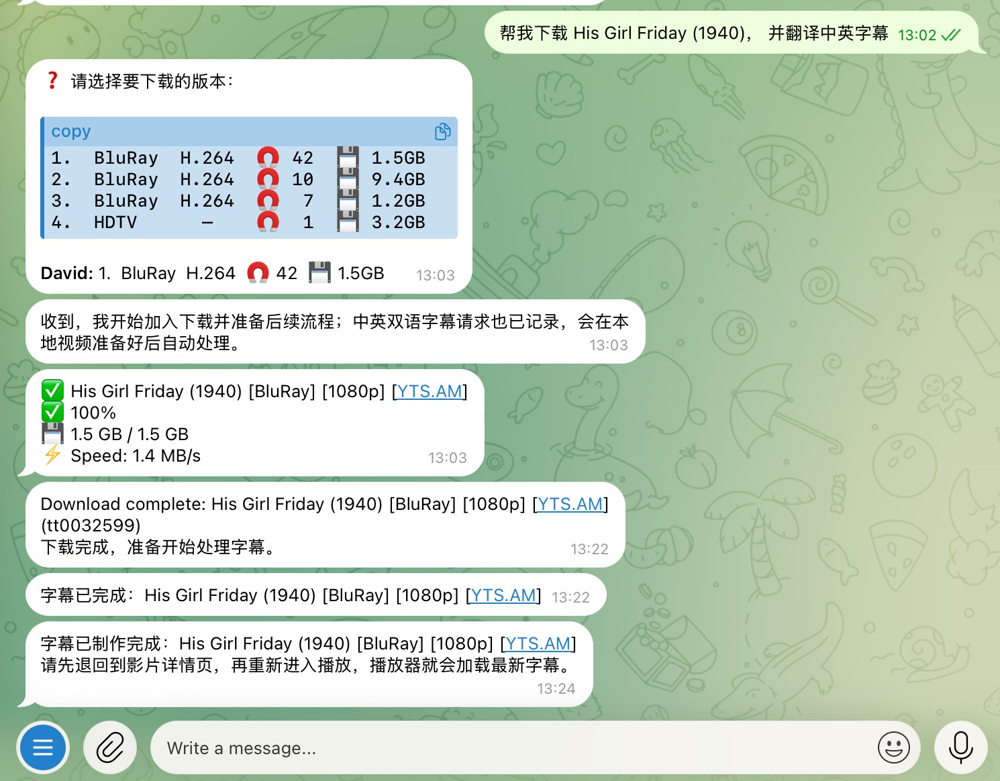
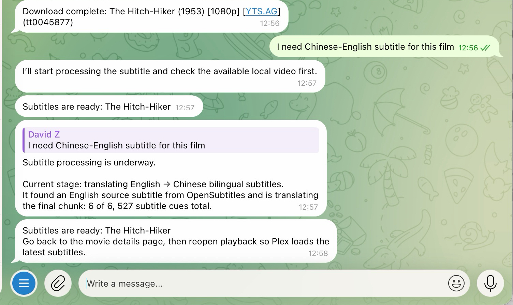

# MPilot

**A unified MCP server for media acquisition, subtitle automation, and agent-run
media workflows.**

MPilot is for people who already run Plex, Jellyfin, Emby, qBittorrent, or
plain local media folders and want an agent or bot to handle requests like:

> Download this movie and make Chinese-English subtitles when it is ready.

It combines three toolsets behind one project:

- **Acquisition** - identify a movie or show, search Prowlarr, rank releases,
  and queue the selected result in qBittorrent.
- **Subtitles** - find source subtitles from sidecars, embedded text tracks,
  Plex metadata, or online providers, then translate and write SRT/ASS sidecars.
- **Runtime** - remember long-running download/subtitle intent so an agent can
  resume work after the original chat turn has ended.

Use all three together through `mpilot-mcp`, or enable only the subtitle tools
when you just want a standalone subtitle plugin.

## What It Can Do

- Accept IMDb IDs/URLs, supported Douban or AlloCine movie links, or plain
  natural-language titles.
- Return title and release choices as agent-friendly structured data.
- Queue downloads into your own qBittorrent through its Web UI API.
- Render chat-ready download progress cards and completion notifications.
- Translate existing `.srt` files or video files with embedded/source subtitles.
- Search configured subtitle providers when local source subtitles are missing.
- Write Plex-compatible sidecars such as `Movie.zh.srt` or `Movie.zh.ass`.
- Expose one MCP server for Claude Desktop, Cursor, Hermes, Cline, OpenClaw,
  ChatGPT MCP bridges, Telegram bots, or custom agents.

MPilot does not provide media, indexers, trackers, subtitle-provider accounts,
or legal advice. Use it only with services and content you are allowed to use.

## What Runs Where

Full media acquisition needs:

- Python 3.12+
- Prowlarr for torrent indexer search
- qBittorrent with Web UI enabled
- Optional FlareSolverr for Cloudflare-protected Prowlarr indexers

Subtitle-only use needs:

- Python 3.12+
- `ffmpeg` and preferably `ffprobe` for local video probing
- A translation backend, such as Codex CLI or an OpenAI-compatible endpoint
- Optional Plex URL/token for library lookup
- Optional OpenSubtitles.com or SubDL credentials for online subtitle fallback

Local sidecar and embedded-subtitle workflows do not require Prowlarr,
qBittorrent, Plex, OpenSubtitles, or SubDL.

## Quick Start

```sh
git clone https://github.com/davezfr/mpilot.git
cd mpilot

python3 -m venv .venv
. .venv/bin/activate
python -m pip install --upgrade pip
python -m pip install -e ".[all]"

cp .env.example .env
```

For development:

```sh
python -m pip install -e ".[all,dev]"
python -m pytest -q
```

## What It Feels Like

When the full toolset is wired to the same agent, one natural-language request
can move through acquisition, download tracking, subtitle source selection,
translation, and sidecar write-back.

<table>
  <tr>
    <td width="48.4%" align="center" valign="middle">
      
    </td>
    <td width="51.6%" align="center" valign="middle">
      
    </td>
  </tr>
</table>

*Screenshots for reference only. The demo uses a public-domain title; rights can
vary by jurisdiction and by specific restoration, soundtrack, subtitles, or
edition.*

```text
User:
  Download His Girl Friday and make Chinese-English subtitles.

Agent:
  1. Calls media_request with the title and subtitle intent.
  2. MPilot identifies the title, searches Prowlarr, and queues the best match.
  3. Runtime stores the subtitle intent while qBittorrent downloads.
  4. When the local video path is ready, MPilot creates and starts a subtitle job.
  5. The user gets one workflow status instead of separate download/subtitle chores.

Result:
  The media file is downloaded, and MPilot writes a subtitle sidecar such as
  Movie.zh.ass next to the video or in the configured output location.
```

For direct acquisition without subtitles, MPilot can also return a release
picker and progress card:

<p align="center">
  
</p>

For subtitle-only use, point MPilot at an existing video or Plex item:

<p align="center">
  
</p>

## Configure Acquisition

Acquisition is the Prowlarr -> qBittorrent side of MPilot.

1. Enable qBittorrent Web UI and note the URL, username, and password.
2. Start or point MPilot at Prowlarr, then add the indexers you are allowed to
   use.
3. Fill in these values in `.env`:

```sh
MPILOT_PROWLARR_URL=http://prowlarr:9696
MPILOT_PROWLARR_API_KEY=replace-with-prowlarr-api-key

MPILOT_ACQUISITION_API_KEY=replace-with-a-long-random-secret

MPILOT_QBIT_URL=http://host.docker.internal:8080
MPILOT_QBIT_USERNAME=replace-with-webui-username
MPILOT_QBIT_PASSWORD=replace-with-webui-password

MPILOT_ACQUISITION_SAVE_PATH_MOVIE=/downloads/movies
MPILOT_ACQUISITION_SAVE_PATH_MOVIE_4K=/downloads/movies-4k
MPILOT_ACQUISITION_SAVE_PATH_TV=/downloads/tv
```

The acquisition REST API fails closed when `MPILOT_ACQUISITION_API_KEY` is
unset. Clients must send the same value in `X-API-Key`. For a strictly local
development process only, you can explicitly set
`MPILOT_ALLOW_UNAUTHENTICATED_LOOPBACK=true`; do not use that escape hatch for
Docker, LAN, reverse-proxy, or shared deployments.

`MPILOT_ACQUISITION_API_KEY` is an administrator credential. For a shared bot,
configure a JSON map of requester IDs to distinct secrets in
`MPILOT_ACQUISITION_REQUESTER_API_KEYS`, and set each client process's
`MPILOT_ACQUISITION_REQUESTER_ID` to the matching requester ID. A requester
credential cannot select another requester's downloads or snapshots. If one
torrent is tagged for multiple requesters, pause, resume, and delete are denied
until an administrator resolves the shared ownership.

Use a LAN URL instead of `host.docker.internal` when qBittorrent runs on a NAS,
seedbox, or another machine.

## Configure Subtitles

Subtitle workflows can run with local files only, or with Plex/provider
integrations.

```sh
MPILOT_SUBTITLE_BACKEND=codex-cli
MPILOT_SUBTITLE_MODEL=gpt-5.4-mini
MPILOT_SUBTITLE_SOURCE_LANGUAGE=en
MPILOT_SUBTITLE_TARGET_LANGUAGE=zh
MPILOT_SUBTITLE_OUTPUT_MODE=bilingual-ass
```

Optional Plex lookup:

```sh
PLEX_BASE_URL=http://127.0.0.1:32400
PLEX_TOKEN=replace-with-token
MPILOT_PLEX_PATH_PREFIX=/server/media
MPILOT_LOCAL_PATH_PREFIX=/mnt/media
```

Optional online subtitle providers:

```sh
OPENSUBTITLES_API_KEY=replace-with-key
OPENSUBTITLES_USER_AGENT="MPilot v0.1.0"
OPENSUBTITLES_USERNAME=replace-with-username
OPENSUBTITLES_PASSWORD=replace-with-password
SUBDL_API_KEY=replace-with-key
```

If you want MPilot to search third-party subtitle providers, configure at least
one provider credential. Existing sidecars and embedded text subtitles work
without provider credentials.

## MCP Setup

Use `mpilot-mcp` for new integrations.

```json
{
  "command": "/absolute/path/to/mpilot/bin/mpilot-mcp",
  "env": {
    "MPILOT_ENABLE_ACQUISITION_TOOLS": "true",
    "MPILOT_ENABLE_SUBTITLE_TOOLS": "true",
    "MPILOT_PROWLARR_URL": "http://127.0.0.1:9696",
    "MPILOT_PROWLARR_API_KEY": "replace-with-key",
    "MPILOT_QBIT_URL": "http://127.0.0.1:8080",
    "MPILOT_QBIT_USERNAME": "replace-with-user",
    "MPILOT_QBIT_PASSWORD": "replace-with-password",
    "PLEX_BASE_URL": "http://127.0.0.1:32400",
    "PLEX_TOKEN": "replace-with-token"
  }
}
```

Key tools:

- `media_request` - one request for acquisition plus optional subtitle intent.
- `acquisition_handle` - identify/search media and return release choices.
- `acquisition_download` - queue a chosen release.
- `acquisition_render_downloads_status` - return a chat-ready progress card.
- `job_create_video` - create a subtitle job for a direct local video path.
- `job_start` / `job_show` - run and inspect subtitle jobs.
- `queue_status` / `workflow_show` - inspect long-running workflow state when
  operator tools are explicitly enabled.

Raw Runtime store tools are disabled by default; trusted operator integrations
can enable them with `MPILOT_ENABLE_RUNTIME_OPERATOR_TOOLS=true`. Destructive
acquisition controls are likewise opt-in through
`MPILOT_ENABLE_ACQUISITION_CONTROL_TOOLS=true`. Keep both disabled for
untrusted or requester-scoped MCP clients.

For subtitle-only MCP:

```json
{
  "command": "/absolute/path/to/mpilot/bin/mpilot-mcp",
  "env": {
    "MPILOT_ENABLE_SUBTITLE_TOOLS": "true",
    "MPILOT_SUBTITLE_BACKEND": "codex-cli",
    "MPILOT_SUBTITLE_MODEL": "gpt-5.4-mini"
  }
}
```

The MCP tools are language-neutral. Users can ask in English, Chinese, French,
or any language your agent's LLM handles; the agent can answer in the same
language.

## CLI Examples

```sh
# Unified CLI dispatcher
mpilot --help

# Translate an existing video using local/embedded/provider subtitles
mpilot subtitles translate-video "/mnt/media/Movies/Movie.mkv" \
  --source-language en \
  --target-language zh \
  --output-mode bilingual-ass

# Create a persistent subtitle job for agents or bots
mpilot subtitles job-create-video \
  --video-path "/mnt/media/Movies/Movie.mkv" \
  --title "Movie" \
  --media-type movie \
  --source-language en \
  --target-language zh

# Inspect runtime workflow state
mpilot runtime queue-status
```

The REST API deployment unit lives under `mpilot.api.main` and focuses on the
acquisition HTTP surface. Most agent integrations should prefer MCP.

## Daemon

`mpilot-daemon` runs background work that should not depend on a single chat
turn:

- download completion and progress notification polling
- subtitle job notification polling
- runtime dispatch from completed downloads to subtitle jobs

Run one cycle:

```sh
mpilot-daemon --once
```

Deployment templates are in `docs/deploy/launchd.plist` and
`docs/deploy/systemd.service`. The daemon and other MPilot entrypoints load the
nearest project `.env` automatically without replacing variables already set
by the service manager. Set `MPILOT_NO_DOTENV=true` to disable this behavior.

## Docker

The Docker image runs the acquisition REST API deployment unit:

```sh
docker build -f docker/Dockerfile .
```

`docker/docker-compose.yml` includes Prowlarr and optional FlareSolverr, but
qBittorrent is intentionally external. Point MPilot at your existing
qBittorrent Web UI.

Compose requires an acquisition API key and should be launched with the root
project environment file explicitly:

```sh
docker compose --env-file .env -f docker/docker-compose.yml up -d
```

## Migration From qBitlarr And Babelarr

MPilot replaces the separate qBitlarr and Babelarr repositories. Those projects
are archived and kept for history; new work happens here.

For new integrations:

- Use `mpilot-mcp`, not the old per-project MCP launchers.
- Use `media_request` for combined download plus subtitle intent.
- Use `acquisition_*` tools for download-only workflows.
- Use `job_*`, `plex_search`, and `subtitle_plan` for subtitle-only workflows.
- Prefer `MPILOT_*` environment variables.

Requester ownership tags created by hardened MPilot releases include a digest
of the full requester ID. Torrents tagged by an older release are deliberately
not accepted by requester-scoped controls; submitting the same torrent again
through MPilot for the correct requester adds the new tag without duplicating
the qBittorrent job.

See [docs/MIGRATION.md](docs/MIGRATION.md) for old-to-new command,
environment, MCP, and data-location mappings.

## Responsible Use

MPilot is an automation layer. It does not include media, subtitle provider
accounts, indexers, trackers, or legal advice. Use it only with content,
indexers, and subtitle providers that you are allowed to access in your
jurisdiction.

## Third-Party Projects

MPilot integrates with or can call these tools and services:

- [Prowlarr](https://github.com/Prowlarr/Prowlarr) for indexer aggregation.
- [qBittorrent](https://github.com/qbittorrent/qBittorrent) through its Web UI
  API.
- [FlareSolverr](https://github.com/FlareSolverr/FlareSolverr) as an optional
  challenge proxy for Prowlarr indexers.
- Plex, Jellyfin, Emby, or local media folders as library targets.
- OpenSubtitles.com and SubDL as optional subtitle providers.
- Codex CLI or OpenAI-compatible endpoints as translation backends.

MPilot is not affiliated with, endorsed by, or sponsored by those projects or
their maintainers.
