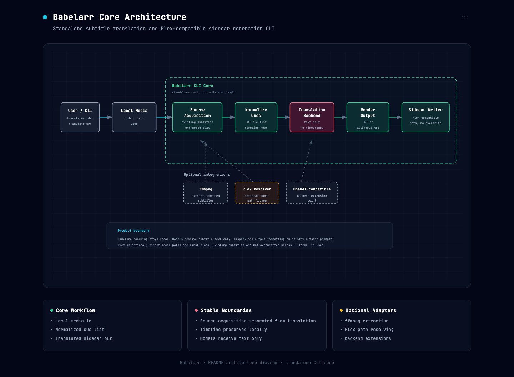

# Babelarr

**Standalone subtitle translation and sidecar automation for media libraries.**

For people who already run Plex, Jellyfin, Emby, qBitlarr, or plain local media
folders and want a lightweight way to turn existing videos into usable subtitle
sidecars without running a full subtitle manager.

Babelarr is one CLI and MCP-capable tool that:

- Accepts an existing `.srt`, a local video file, a completed download
  directory, or a Plex movie/episode reference.
- Finds a source subtitle from local sidecars, MicroDVD text `.sub`, embedded
  text subtitle streams, or configured online subtitle providers.
- Normalizes source subtitles to standard SRT cues before translation.
- Translates cue text only, while local code owns cue ids, timestamps, cue
  counts, chunk ordering, rendering, and output filenames.
- Writes Plex-compatible sidecars such as `Movie.zh.srt` or `Movie.zh.ass`.
- Runs directly from the CLI, from persistent background jobs, or through an MCP
  server used by an agent or chat adapter.

It is not a Bazarr plugin, and the core workflow does not require Plex, Sonarr,
Radarr, or a media-library server.

## Architecture



Babelarr's core workflow stays deliberately local and deterministic. Source
acquisition produces a normalized SRT cue list, the translation backend receives
cue text only, and local code validates cue ids, cue count, timeline, rendering,
output naming, and no-overwrite behavior.

Plex, qBitlarr, Runtime, online providers, ffmpeg, and OpenAI-compatible
endpoints are adapters around that core. Direct local video and subtitle paths
remain first-class.

The tested reference backend is:

```text
Codex CLI + gpt-5.4-mini
```

The `openai-compatible` backend exists as an advanced-user extension point, but
model servers and endpoint adapters can differ in cue alignment and structured
output reliability. The local test suite uses the `fake` backend and does not
call a real model.

## What Runs Locally

- `babelarr` - the CLI for direct translation, Plex resolution, provider
  search, persistent jobs, and recovery.
- `babelarr-mcp` - the stdio MCP server that exposes subtitle planning and job
  tools to Claude Desktop, Cursor, Hermes, OpenClaw, Cline, custom agents, or
  any other MCP host.
- `babelarr-runtime-mcp` - an optional stdio MCP server that coordinates
  qBitlarr download state and downstream Babelarr subtitle jobs.
- A local job store under `~/.local/share/babelarr/jobs` by default.
- Optional provider/API credentials through `.env` or process environment.

Babelarr does not ship a long-running web service by default. For chat or bot
use, create a persistent job, start it in the background, then poll `job-show`
or use notification watches.

## Setup

Requirements:

- Python 3.10+
- `ffmpeg`
- `ffprobe` preferred; if it is missing, Babelarr can fall back to parsing
  `ffmpeg -i` output for subtitle stream discovery.
- One translation backend:
  - local Codex CLI auth for the tested reference backend, or
  - an OpenAI-compatible chat completions endpoint for experimental use.

Optional integrations:

- Plex base URL/token and path-prefix mapping for Plex item resolution.
- OpenSubtitles.com and/or SubDL credentials for online subtitle fallback.
- The `mcp` extra for MCP server support.

Install for local use:

```sh
git clone https://github.com/davezfr/babelarr.git
cd babelarr
python3 -m pip install -e .
```

For MCP support:

```sh
python3 -m pip install -e '.[mcp]'
```

Create a local environment file:

```sh
cp .env.example .env
```

Common settings:

```sh
BABELARR_BACKEND=codex-cli
BABELARR_MODEL=gpt-5.4-mini

# Optional output default for Plex/job workflows.
BABELARR_OUTPUT_MODE=bilingual-ass

# Optional Plex resolver settings.
PLEX_BASE_URL=http://127.0.0.1:32400
PLEX_TOKEN=replace-with-token
BABELARR_PLEX_PATH_PREFIX=/server/media
BABELARR_LOCAL_PATH_PREFIX=/mnt/media

# Optional provider fallback.
OPENSUBTITLES_API_KEY=replace-with-key
OPENSUBTITLES_USER_AGENT="Babelarr v0.1.0"
OPENSUBTITLES_USERNAME=replace-with-username
OPENSUBTITLES_PASSWORD=replace-with-password
SUBDL_API_KEY=replace-with-key
```

The CLI loads `.env` from the current directory or a parent directory. Exported
environment variables and explicit CLI flags take precedence. Do not commit
tokens, provider passwords, local bot profile names, or private machine paths.

## Quick Start

Translate an existing SRT:

```sh
babelarr translate-srt input.en.srt \
  --source-language en \
  --target-language zh \
  --backend codex-cli \
  --output output.zh.srt
```

Smoke-test the same path without a real model:

```sh
babelarr translate-srt input.en.srt \
  --source-language en \
  --target-language zh \
  --backend fake \
  --output output.zh.srt
```

Translate a local video into bilingual Chinese-English ASS:

```sh
babelarr translate-video Movie.mkv \
  --source-language en \
  --target-language zh \
  --backend codex-cli \
  --output-mode bilingual-ass
```

`translate-video` accepts either a media file or a completed download
directory. When the input is a directory, Babelarr resolves the largest
supported video file under it before sidecar lookup, embedded subtitle probing,
and output naming.

Create a persistent direct-video job for agents, bots, or qBitlarr completion
hooks:

```sh
babelarr job-create-video \
  --video-path "/mnt/media/Movies/Movie.mkv" \
  --imdb-id tt1234567 \
  --title "Movie" \
  --media-type movie \
  --source-language en \
  --target-language zh \
  --output-mode bilingual-ass
```

For TV episode jobs, pass season and episode when you know them. If those flags
are omitted, Babelarr also tries to infer `SxxEyy` from the video filename or
title before searching online providers:

```sh
babelarr job-create-video \
  --video-path "/mnt/media/TV/Show/Show.S09E04.1080p.WEB-DL.mkv" \
  --imdb-id tt1234567 \
  --title "Show S09E04 - Episode Title" \
  --media-type episode \
  --season 9 \
  --episode 4 \
  --source-language en \
  --target-language zh \
  --output-mode bilingual-ass
```

Start the job in the background:

```sh
babelarr job-start job_20260610T120000Z_abcd1234
```

Check status:

```sh
babelarr job-show job_20260610T120000Z_abcd1234
```

`job-show` includes `status_detail`, which is the preferred field for bot or
agent status replies.

## What It Feels Like

Once Babelarr is wired to an agent, the user-facing flow can stay close to how
you would ask a person for subtitles:

<table>
  <tr>
    <td width="54.8%" align="center" valign="middle">
      
    </td>
    <td width="45.2%" align="center" valign="middle">
      
    </td>
  </tr>
</table>

*Screenshots for reference only. The demo titles are public-domain examples;
rights can vary by jurisdiction and by specific restoration, soundtrack,
subtitles, or edition.*

> **You:** *Make Chinese-English subtitles for `/mnt/media/Movies/The Hitch-Hiker.mkv`.*
>
> **Agent:** I found an English source subtitle, started a Babelarr job, and
> will write a bilingual ASS sidecar when it finishes.

> **You:** *What's the subtitle status?*
>
> **Agent:** Translating English to Chinese. Chunk 4 of 9 is complete; output
> mode is `bilingual-ass`.

> **Agent:** Subtitle job finished. Babelarr wrote `The Hitch-Hiker.zh.ass`
> next to the video.

For Plex flows, the agent can resolve a Plex item first and then run the same
subtitle workflow. For completed download flows, qBitlarr or another tool can
pass the local video path or download directory directly to `job-create-video`.

### Pro tip: pass metadata when local subtitles are missing

If the video has no useful local source subtitle, pass an IMDb ID, title, media
type, season, and episode when you can. That gives Babelarr enough context to
search configured subtitle providers and rank subtitle candidates against the
actual release name.

## When To Use This vs Bazarr

Use **Bazarr** if you want a full subtitle manager: service-based library
monitoring, Sonarr/Radarr integration, provider scheduling, and a dedicated UI.

Use **Babelarr** if you just want: *"this video exists locally, create a
translated Plex sidecar for it."* One CLI, deterministic subtitle handling,
persistent jobs when you need automation, and no requirement to run a library
scanner.

Use **qBitlarr** when you need to search and download media first. qBitlarr and
Babelarr can be paired so an agent downloads the video and then prepares the
subtitle sidecar.

Current non-goals:

- Bazarr plugin behavior
- Sonarr/Radarr integration
- OCR for PGS/VobSub image subtitles
- Web UI
- Whole-library monitoring
- Unbounded whole-season translation without an explicit episode range

## Responsible Use

Babelarr automates subtitle acquisition, translation, and sidecar writing. It
does not provide media, legal advice, or a guarantee that third-party subtitle
files are licensed for your use. Use it only with media, providers, and subtitle
files you are allowed to access in your jurisdiction.

## Source Subtitle Flow

Babelarr is local-first:

```text
existing target-language sidecar
  -> source-language sidecar or MicroDVD text .sub
  -> embedded text subtitle stream
  -> online provider fallback when metadata is available
  -> unsupported
```

Supported source paths:

- Sidecar SRT, such as `Movie.en.srt`.
- MicroDVD text `.sub` files with an FPS declaration, such as
  `{1}{1}23.976`.
- Embedded text subtitle streams extracted with `ffmpeg`.
- Online provider downloads staged from SubDL or OpenSubtitles.

Unsupported for now:

- PGS/VobSub image subtitle OCR.
- Treating binary VobSub `.sub` files as MicroDVD text.

For NAS-hosted media, Babelarr can optionally run embedded subtitle probing and
extraction on the NAS over SSH when path-prefix mapping and
`BABELARR_SOURCE_REMOTE_SSH_HOST` are configured. The extracted SRT is then
returned to the local worker for normalization and translation.

## Online Subtitle Providers

Third-party subtitle search and download requires at least one configured
provider credential. For personal use, start with the free account/API keys from
the supported providers:

- SubDL: set `SUBDL_API_KEY`.
- OpenSubtitles.com: set `OPENSUBTITLES_API_KEY` plus
  `OPENSUBTITLES_USERNAME` / `OPENSUBTITLES_PASSWORD`, or provide an existing
  `OPENSUBTITLES_TOKEN`.

Local sidecars and embedded subtitles still work without provider keys. Paid
provider plans are only needed if your usage exceeds the free personal limits.

`subtitle-search` queries providers and prints normalized JSON candidates. It
does not mutate the media folder:

```sh
babelarr subtitle-search \
  --provider all \
  --imdb tt1375666 \
  --media-type movie \
  --language en
```

`subtitle-fetch` searches configured providers and downloads the best source
subtitle into a staging directory:

```sh
babelarr subtitle-fetch \
  --imdb tt1375666 \
  --media-type movie \
  --file-name "Movie.2010.1080p.WEBRip.x264-GRP.mkv" \
  --language en \
  --output-dir .runtime/provider-fetch
```

Default provider download priority:

```text
SubDL -> OpenSubtitles
```

Override it with:

```sh
export BABELARR_SUBTITLE_DOWNLOAD_PRIORITY=subdl,opensubtitles
```

Provider fallback is release-aware. Web-family subtitles are not treated as a
safe automatic match for BluRay-family videos, and the reverse is also treated
as incompatible. Low-confidence matches return a confirmation proposal instead
of downloading automatically; retry with `--allow-low-confidence-subtitle` only
after user confirmation.

## Translation Backend

By default Babelarr uses the tested reference backend:

```sh
BABELARR_BACKEND=codex-cli
BABELARR_MODEL=gpt-5.4-mini
```

For quick tests and CI, use the deterministic fake backend:

```sh
babelarr translate-srt input.en.srt \
  --source-language en \
  --target-language zh \
  --backend fake \
  --output output.zh.srt
```

For experimental OpenAI-compatible endpoints:

```sh
BABELARR_BACKEND=openai-compatible
OPENAI_BASE_URL=http://127.0.0.1:11434/v1
OPENAI_API_KEY=ollama
```

OpenAI-compatible mode uses the same translation contract, but model behavior
can vary. Treat each model/server combination as unverified until you have
tested cue alignment on a real sample.

## Language And Output Preferences

Direct `translate-srt` and `translate-video` commands default to
`single-srt`. Plex and persistent job commands default to `bilingual-ass`
unless `BABELARR_OUTPUT_MODE` is set.

Common env settings:

```sh
BABELARR_PREFERRED_SOURCE_LANGUAGE=en
BABELARR_OUTPUT_MODE=bilingual-ass
BABELARR_ASS_PRIMARY_SCRIPT=cjk
BABELARR_ASS_SECONDARY_SCRIPT=latin
BABELARR_ASS_HEIGHT=1080
```

The common direct path is English source subtitles to Chinese bilingual ASS,
but the workflow remains language-pair based:

```text
source_language -> target_language
```

The main near-term presets are English to Chinese, English to French, and
French to Chinese. Other LLM-supported language pairs can work, but should be
verified on real media before relying on them.

## How A Subtitle Job Is Resolved

Every video/Plex job follows the same shape:

1. **Resolve the input.** Babelarr accepts a direct SRT, a local video file, a
   completed download directory, or a Plex movie/episode reference. Plex is only
   a resolver that turns catalog metadata into a local media path.
2. **Acquire a source subtitle.** Local source subtitles are preferred.
   Provider fallback runs when enough metadata is available and provider
   credentials are configured.
3. **Normalize to SRT cues.** MicroDVD `.sub`, provider downloads, and embedded
   text subtitles are converted into one standard cue list.
4. **Translate cue text only.** The backend sees cue ids and text. It does not
   own timestamps or full subtitle file formatting.
5. **Validate the result.** Babelarr checks cue ids, cue count, empty text, and
   timeline preservation before rendering.
6. **Write the sidecar.** Output is either a single-language SRT or bilingual
   ASS using Plex-compatible target-language naming.

Low-confidence provider matches and fallback-language provider matches can stop
the job in `needs_confirmation`. Present the proposal to the user, then retry
with the matching confirmation command only after they accept the risk.

### Output Modes

- `single-srt` - write one target-language SRT sidecar, such as
  `Movie.zh.srt`.
- `bilingual-ass` - write an ASS sidecar with target-language primary lines and
  source-language reference lines, such as `Movie.zh.ass`.

For Plex-facing filenames, the language code is always the target language:

```text
en -> zh, bilingual-ass  => Movie.zh.ass
en -> fr, bilingual-ass  => Movie.fr.ass
fr -> zh, bilingual-ass  => Movie.zh.ass
```

The source language can appear inside bilingual ASS as the secondary/reference
line, but it does not participate in the sidecar filename. Existing output
files are not overwritten unless `--force` is passed.

## Persistent Jobs And Recovery

Babelarr stores persistent job records outside the repo by default:

```text
~/.local/share/babelarr/jobs
```

Override with `BABELARR_JOB_STORE_DIR`, the legacy `MST_JOB_STORE_DIR`, or
`--job-store-dir`.

Create a Plex job without running it:

```sh
babelarr job-create \
  --rating-key 1468 \
  --source-language en \
  --target-language zh \
  --output-mode bilingual-ass \
  --write-back
```

Create a direct local-video job:

```sh
babelarr job-create-video \
  --video-path "/mnt/media/Movies/Movie.mkv" \
  --source-language en \
  --target-language zh \
  --output-mode bilingual-ass
```

Show or list records:

```sh
babelarr job-show job_20260610T120000Z_abcd1234
babelarr job-list --status failed
```

Run one job synchronously:

```sh
babelarr job-run job_20260610T120000Z_abcd1234
```

Start one job in the background for chat adapters:

```sh
babelarr job-start job_20260610T120000Z_abcd1234
```

Resume recoverable jobs:

```sh
babelarr job-resume --stale-after-seconds 3600 --limit 10
```

Prune old successful records:

```sh
babelarr job-prune --dry-run
babelarr job-prune --retention-days 90
```

Job records are a local ledger, not session memory. They survive agent
sessions, bot restarts, and worker restarts, but they do not store secrets such
as `PLEX_TOKEN`, provider passwords, provider API keys, or model API keys.

## Connect To An Agent

Babelarr ships as an **MCP server**, so any agent that speaks the
[Model Context Protocol](https://modelcontextprotocol.io) can create subtitle
jobs and inspect progress.

The MCP tools are language-neutral. Users can ask in English, Chinese, French,
or any language your agent's LLM handles; the agent can answer in the same
language you use. That multilingual behavior depends on the LLM behind your
agent, not on Babelarr itself.

One transport is available:

- **stdio MCP** - most desktop agent apps launch `bin/babelarr-mcp` as a
  subprocess.

Tools exposed by the Babelarr MCP server:

```text
plex_search
subtitle_plan
job_create
job_create_video
job_start
job_show
job_run
job_resume
job_confirm_low_confidence
job_confirm_provider_fallback_language
job_prune
```

For long-running chat workflows, prefer `job_create` or `job_create_video`,
then `job_start`, then `job_show`. `job_run` is synchronous and can exceed chat
tool timeouts.

The stdio MCP wrapper can send running status and terminal notices through
Hermes-style targets:

- Pass `notification_target` such as `telegram:<chat-id>` to `job_start`.
- If `requester_id` is already a Hermes target, Babelarr can reuse it.
- `job-show.status_detail` is the structured field agents should use for
  progress replies.
- `notification_language` controls user-facing status language separately from
  subtitle `target_language`.
- `notify-daemon` is the local sender responsible for terminal notices.

For cross-MCP qBitlarr-to-Babelarr workflow state, run the Runtime MCP server
too:

```sh
bin/babelarr-runtime-mcp
```

Installed console script:

```sh
babelarr-runtime-mcp
```

Runtime records qBitlarr downloads, attaches subtitle intent, waits for a
completed local media path, claims the next ready Babelarr direct-video action,
and mirrors downstream Babelarr job status into one workflow summary.

### Claude Desktop

Edit `~/Library/Application Support/Claude/claude_desktop_config.json` (macOS)
or `%APPDATA%\Claude\claude_desktop_config.json` (Windows):

```json
{
  "mcpServers": {
    "babelarr": {
      "command": "/absolute/path/to/babelarr/bin/babelarr-mcp",
      "env": {
        "BABELARR_JOB_STORE_DIR": "/absolute/path/to/babelarr/jobs"
      }
    },
    "runtime": {
      "command": "/absolute/path/to/babelarr/bin/babelarr-runtime-mcp",
      "env": {
        "BABELARR_RUNTIME_STORE_DIR": "/absolute/path/to/runtime/workflows"
      }
    }
  }
}
```

Restart Claude Desktop. The Babelarr tools appear in the tool list and Claude
uses them when you ask for subtitles.

### Cursor

Settings -> **MCP** -> **Add new MCP server**:

```json
{
  "mcpServers": {
    "babelarr": {
      "command": "/absolute/path/to/babelarr/bin/babelarr-mcp"
    },
    "runtime": {
      "command": "/absolute/path/to/babelarr/bin/babelarr-runtime-mcp"
    }
  }
}
```

### Any other MCP host (Hermes, OpenClaw, Cline, custom agents)

The pattern is the same: configure the host to launch `bin/babelarr-mcp` as a
subprocess. Add `bin/babelarr-runtime-mcp` only when the agent needs to remember
download state from qBitlarr or another acquisition tool before launching a
Babelarr job.

### Tell your agent when to use Babelarr

If your agent supports a system prompt or "tool instructions" field, add a
short pointer so it reaches for Babelarr at the right moment:

> *When the user asks for subtitles for an existing local/Plex video or a
> completed download, use Babelarr. Prefer persistent jobs: create the job,
> start it in the background, then use job status to report progress. Use
> qBitlarr only when media must be searched and downloaded first. If Babelarr
> returns a low-confidence subtitle or fallback-language confirmation proposal,
> present it to the user before continuing.*

### Quick sanity check

After wiring it up, ask the agent: *"Use Babelarr `job_prune` with
`dry_run: true` to confirm the MCP server can reach the job store."* For the
Runtime MCP server, ask it to call `queue_status`.

## CLI

Common commands:

```sh
babelarr translate-srt input.en.srt \
  --source-language en \
  --target-language zh \
  --output output.zh.srt

babelarr translate-video Movie.mkv \
  --source-language en \
  --target-language zh \
  --output-mode bilingual-ass

babelarr plex-resolve --rating-key 1468

babelarr plex-search --query "Example Movie"

babelarr subtitle-plan --rating-key 1468 --target-language zh

babelarr subtitle-search \
  --provider all \
  --imdb tt1375666 \
  --media-type movie \
  --language en

babelarr subtitle-fetch \
  --imdb tt1375666 \
  --media-type movie \
  --language en \
  --output-dir .runtime/provider-fetch

babelarr subtitle-download \
  --provider subdl \
  --url "https://example.invalid/subtitle.srt" \
  --file-name Movie.en.srt \
  --output-dir .runtime/provider-download

babelarr translate-plex --rating-key 1468 --write-back

babelarr translate-plex-season \
  --imdb tt1234567 \
  --season 1 \
  --episode-start 1 \
  --episode-end 3

babelarr job-create \
  --rating-key 1468 \
  --target-language zh \
  --output-mode bilingual-ass

babelarr job-create-video \
  --video-path /mnt/media/Movies/Movie.mkv \
  --target-language zh \
  --output-mode bilingual-ass

babelarr job-start job_20260610T120000Z_abcd1234
babelarr job-show job_20260610T120000Z_abcd1234
babelarr job-resume --stale-after-seconds 3600 --limit 10
babelarr job-prune --dry-run
babelarr notify-daemon
```

`translate-plex-season` is deliberately bounded. It requires an explicit
season and episode range, then translates at most three episodes per invocation
in serial order. The returned JSON includes the next batch range when more
episodes remain.

## Plex Integration

Plex is optional. Babelarr accepts local paths directly, and the Plex resolver
is only a convenience for turning a Plex item into a concrete local media file
path.

Resolve a movie by IMDb ID:

```sh
babelarr plex-resolve \
  --imdb tt1234567 \
  --plex-base-url http://127.0.0.1:32400 \
  --plex-token replace-with-token \
  --plex-path-prefix "/server/media" \
  --local-path-prefix "/mnt/media"
```

Resolve an episode:

```sh
babelarr plex-resolve \
  --imdb tt1234567 \
  --season 1 \
  --episode 3
```

Search Plex by title for local-first bot routing:

```sh
babelarr plex-search \
  --query "Example Movie" \
  --year 2026
```

For TV episodes, pass season and episode when possible. If
`BABELARR_LOCAL_PATH_PREFIX` or `--local-path-prefix` is configured, Babelarr
checks matching local episode files first and can still confirm the source when
Plex is offline or unreachable:

```sh
babelarr plex-search \
  --query "Example Show S09E03 Episode Title" \
  --season 9 \
  --episode 3
```

Translate a Plex movie or single episode:

```sh
babelarr translate-plex \
  --rating-key 1468 \
  --source-language en \
  --target-language zh \
  --output-mode bilingual-ass
```

By default, `translate-plex` stages generated subtitles under the work
directory or `.runtime`. Use `--write-back` to write the final Plex-compatible
sidecar next to the media file:

```sh
babelarr translate-plex \
  --rating-key 1468 \
  --write-back
```

`--refresh-plex` asks Plex to scan the media folder after successful
write-back, but client screens may still need to leave and re-enter the item
before the new sidecar is visible.

## Credentials And Local State

Babelarr reads `.env` from the current directory or a parent directory. Keep
deployment-specific values in ignored local files or environment variables:

```sh
BABELARR_JOB_STORE_DIR=~/.local/share/babelarr/jobs
BABELARR_RUNTIME_STORE_DIR=~/.local/share/media-workflow-runtime/workflows

PLEX_BASE_URL=http://127.0.0.1:32400
PLEX_TOKEN=replace-with-token

OPENSUBTITLES_API_KEY=replace-with-key
OPENSUBTITLES_USER_AGENT="Babelarr v0.1.0"
SUBDL_API_KEY=replace-with-key
```

For qBitlarr container-to-host path rewrites, set:

```sh
BABELARR_RUNTIME_CONTENT_PATH_PREFIX=/media
BABELARR_RUNTIME_LOCAL_CONTENT_PATH_PREFIX=/mnt/media
```

The job store and Runtime store contain workflow records, status, and generated
job IDs. They should not contain provider passwords, Plex tokens, or model API
keys.

## Runtime Queue

The optional Runtime package coordinates cross-MCP workflows. It does not
search media and does not translate subtitles; it only records state and claims
ready Babelarr actions.

Typical Runtime commands:

```sh
babelarr-runtime record-qbitlarr-download-with-subtitle-intent \
  --requester-id 'telegram:<chat-id>' \
  --info-hash abcdef1234567890 \
  --title "Example Movie" \
  --imdb-id tt1234567 \
  --media-type movie \
  --source-language en \
  --target-language zh \
  --output-mode bilingual-ass

babelarr-runtime handle-qbitlarr-completion \
  --info-hash abcdef1234567890 \
  --content-path "/mnt/media/Movies/Example Movie/Example Movie.mkv"

babelarr-runtime queue-status
```

Use Runtime when a download may finish after the original chat/tool call has
ended. For simple scripts where the completed video path is already known,
calling `babelarr job-create-video` directly is enough.

`queue-status` refreshes terminal Babelarr job state from the configured job
store before reporting active/ready counts, so completed jobs do not stay
visible as active Runtime tasks. Use `BABELARR_JOB_STORE_DIR` or
`--job-store-dir` if the Runtime and Babelarr job stores are not in their
default locations.

## Project Structure

```text
babelarr/
├── babelarr/                  Core CLI package and subtitle workflow
│   ├── cli.py                 argparse CLI and job command dispatch
│   ├── workflow.py            video/SRT translation workflow
│   ├── source.py              sidecar lookup, ffprobe/ffmpeg, NAS execution
│   ├── normalize.py           supported subtitle formats -> SRT cues
│   ├── translate.py           chunking, backend calls, validation
│   ├── ass.py                 bilingual ASS rendering
│   ├── plex_resolver.py       Plex metadata and path mapping
│   ├── providers/             OpenSubtitles/SubDL adapters
│   ├── jobs.py                persistent job ledger
│   └── mcp_server.py          stdio MCP adapter for Babelarr jobs
├── media_workflow_runtime/    Cross-MCP Runtime queue and dispatcher
├── media_subtitle_translator/ Compatibility namespace
├── bin/                       `babelarr-mcp` and Runtime launchers
├── tests/                     unittest suite
└── pyproject.toml, .env.example, README.md
```

The CLI is the canonical surface. The stdio MCP server is a thin wrapper around
CLI command summaries, and Runtime is a separate state layer for multi-tool
workflows.

## Pair With qBitlarr For Downloads

[qBitlarr](https://github.com/davezfr/qbitlarr) handles media acquisition.
Babelarr handles subtitle acquisition, translation, rendering, and sidecar
write-back.

<table>
  <tr>
    <td width="48.4%" align="center" valign="middle">
      
    </td>
    <td width="51.6%" align="center" valign="middle">
      
    </td>
  </tr>
</table>

*Combined workflow screenshot for reference only. The demo uses a public-domain
title; rights can vary by jurisdiction and by specific restoration, soundtrack,
subtitles, or edition.*

When both MCP servers are available to the same agent, the user-facing workflow
can stay simple:

```text
User:
  Download The Hitch-Hiker and make Chinese-English subtitles.

Agent:
  1. Call qbitlarr_handle to search and queue the movie.
  2. Watch qBitlarr status until qBittorrent reports a completed local path.
  3. Record the subtitle intent in Runtime, or call Babelarr job_create_video
     directly with the completed video path.
  4. Call Babelarr job_start and watch job_show/status_detail.
  5. Tell the user where the generated sidecar was written.

Result:
  qBitlarr downloads the media, and Babelarr writes a subtitle such as
  Movie.zh.ass next to the video or in the configured staging directory.
```

For a direct setup, an agent can call qBitlarr first and then call Babelarr
with the completed video path. For a more durable queue, expose the Runtime MCP
server as well; it can remember the qBitlarr download, attach subtitle intent,
and dispatch Babelarr when the local media path is ready.

## Third-Party Projects

Babelarr integrates with or can call these external tools and services:

- **ffmpeg / ffprobe** for local or NAS-side subtitle stream inspection and
  extraction.
- **Plex** as an optional media-path resolver and sidecar write-back target.
- **OpenSubtitles.com** and **SubDL** as optional online subtitle providers.
- **Codex CLI** as the tested reference translation backend.
- **qBitlarr** as an optional companion for media acquisition before subtitle
  work starts.

Babelarr is not affiliated with, endorsed by, or sponsored by those projects or
services.

## Testing

Run the local test suite:

```sh
python3 -m unittest discover -s tests -v
```

The tests use the `fake` backend and are intended to pass without Plex,
provider credentials, qBitlarr, Hermes, or a real model endpoint.

## License

MIT.
