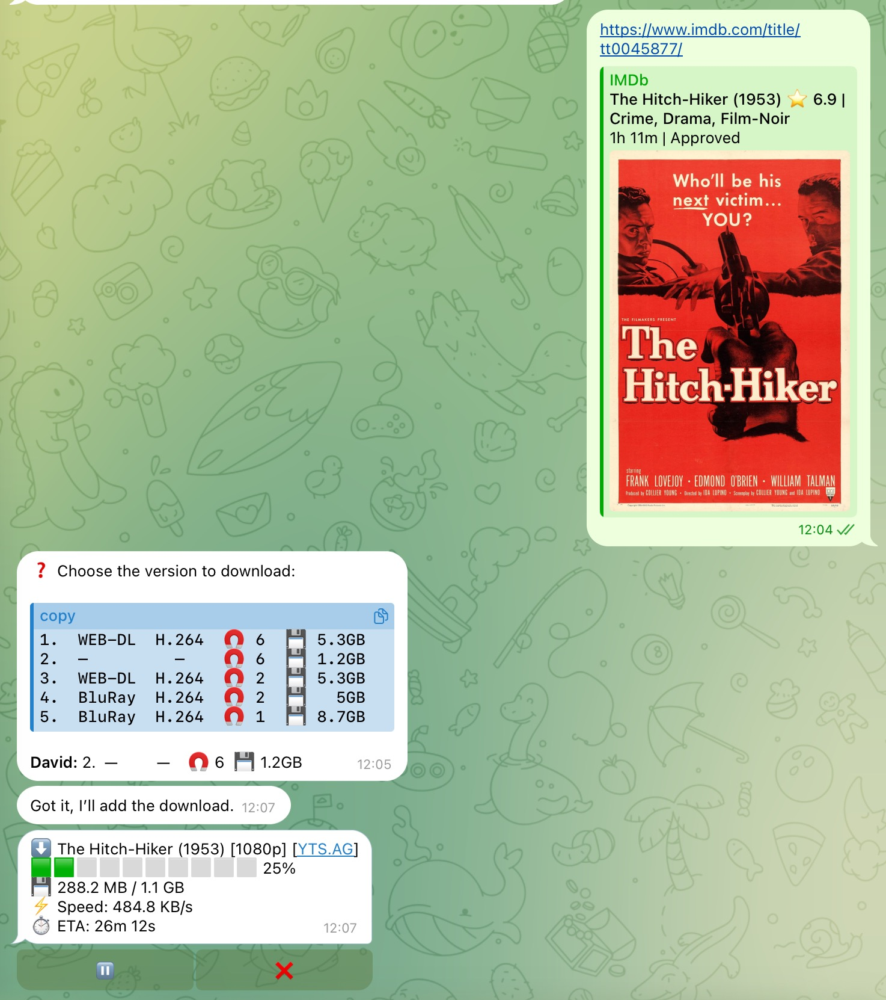
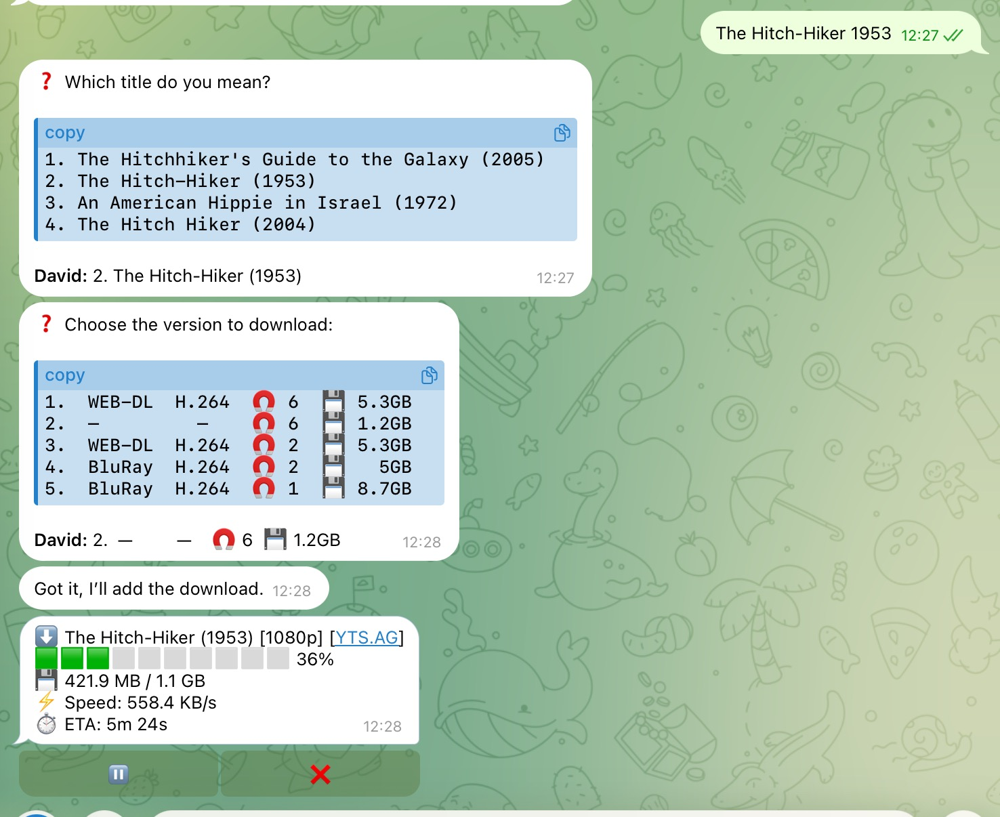

# qBitlarr

**语言:** [English](README.md) | 中文 | [Français](README.fr.md)

**一个连接 Prowlarr 和 qBittorrent 的轻量桥接服务，支持 REST、MCP 和 CLI。**

适合已经在跑 Plex、Jellyfin 或 Emby，并且想让朋友、家人或 LLM Agent 通过简单请求下载影视内容的人。你不用把 qBittorrent 账号暴露出去，也不用部署完整的 Sonarr + Radarr 套件。

qBitlarr 是一个小型 FastAPI 服务，可以：

- 接收自然语言标题、IMDb ID，或 IMDb / Douban / AlloCine 链接。
- 先识别具体标题，再通过你的 Prowlarr indexer 搜索资源。
- 按可配置的质量偏好排序发布版本，并把前几个候选展示给你选择。
- 把你的选择加入现有 qBittorrent（或在 `auto` 模式下自动选择最佳版本）。
- 同时暴露 REST、MCP 和小型 CLI，方便接入 Claude Desktop、Cursor、ChatGPT custom tools、Telegram bot、shell 脚本、cron job 或你自己的 Agent。

可通过任意 HTTP client、Claude/Cursor/ChatGPT 的 MCP，或 `qbitlarr` CLI 使用。

## 架构


REST / MCP / CLI 架构图的可编辑源文件：[docs/architecture.svg](docs/architecture.svg)。

## Docker Compose 会启动什么

- `qbitlarr` — FastAPI 服务，默认在 `http://localhost:8000`
- `prowlarr` — 内置 Prowlarr，默认在 `http://localhost:9696`
- `flaresolverr` — 内置 FlareSolverr，默认在 `http://localhost:8191`

qBittorrent **不会**被打包进 compose。你需要把 qBitlarr 指向一个已有的 qBittorrent，例如桌面版、NAS、seedbox 或另一个容器。相关环境变量是 `QBIT_URL`、`QBIT_USERNAME`、`QBIT_PASSWORD`。

## qBittorrent 设置

qBitlarr 需要你先安装好 qBittorrent，因为每个人的下载环境和媒体库路径都不一样：有人跑桌面版，有人跑 NAS、seedbox 或单独的容器。qBitlarr 只通过 qBittorrent Web UI API 把下载链接发过去。

启动 qBitlarr 前：

1. 在负责下载的机器上安装 qBittorrent。
2. 在 qBittorrent 里打开 **Preferences / Options → Web UI**，启用 Web User Interface。
3. 设置或确认 Web UI 的用户名和密码。
4. 把这些信息填进 `.env`：

```sh
QBIT_URL=http://host.docker.internal:8080
QBIT_USERNAME=your-webui-username
QBIT_PASSWORD=your-webui-password
```

如果 qBittorrent 和 Docker Compose 跑在同一台机器上，通常用 `http://host.docker.internal:8080`。如果 qBittorrent 跑在 NAS、seedbox 或另一台电脑上，就填写那台机器的局域网地址，例如 `http://192.168.1.50:8080`。不要在 `.env` 里用 `localhost` 指向宿主机上的 qBittorrent；在 Docker 容器里，`localhost` 指的是 qBitlarr 容器自己。

## 快速开始

```sh
cp .env.example .env
# 编辑 .env：填入 qBittorrent Web UI 的 QBIT_URL、QBIT_USERNAME、QBIT_PASSWORD

# 1. 先启动 Prowlarr，方便获取 API key
docker compose up -d prowlarr flaresolverr

# 2. 打开 http://localhost:9696，完成首次设置，添加 indexer，
#    然后从 Settings -> General -> Security 复制 API key
# 3. 把 API key 写入 .env：PROWLARR_API_KEY=...

# 4. 启动剩余服务
docker compose up -d --build

# 5. 试一下
curl -X POST http://localhost:8000/handle \
  -H 'Content-Type: application/json' \
  -d '{"user_message":"tt0045877"}'
```

如果想检查依赖是否也可达，可以用深度健康检查：

```sh
curl 'http://localhost:8000/health?deep=true'
```

## 用起来是什么感觉

把 qBitlarr 接到你的 Agent 上（或者直接用 CLI）之后，你就可以像跟懂你媒体库的朋友说话一样跟它沟通：

对于电影请求，qBitlarr 可以直接接受 IMDb 链接和 ID，也可以把支持的 Douban 电影链接/ID、AlloCine 电影链接/ID 解析到同一条 IMDb 流程里。如果 Douban 或 AlloCine 电影无法可靠解析，qBitlarr 会要求用户提供 IMDb，而不是猜测。

下面的示例使用 [The Hitch-Hiker (1953)](https://www.imdb.com/title/tt0045877/)，这是一部被 Library of Congress 收录在 [Public Domain Films from the National Film Registry](https://www.loc.gov/free-to-use/public-domain-films-from-the-national-film-registry/) 列表中的 public-domain film。权利状态仍可能因司法辖区、具体修复版、配乐、字幕或版本而不同。

<table>
  <tr>
    <td width="42.5%" align="center" valign="middle">
      
    </td>
    <td width="57.5%" align="center" valign="middle">
      
    </td>
  </tr>
</table>

*截图示例仅供参考。左图展示 IMDb 链接或 ID 直接进入发布版本选择和下载进度；右图展示搜索 `The Hitchhiker 1953` 后先出现 4 个标题选项，点选 The Hitch-Hiker (1953) 后进入同一套发布版本选择和进度视图。Demo 标题为公共领域（Public Domain）示例；权利状态仍可能因司法辖区、具体发行版、修复版、配乐、字幕或版本而不同。*

> **你：** *帮我下载 The Hitchhiker 1953。*
> **Agent：** 你指的是哪一个标题？
>   1. The Hitchhiker's Guide to the Galaxy (2005)
>   2. The Hitch-Hiker (1953)
>   3. An American Hippie in Israel (1972)
>   4. The Hitch Hiker (2004)

> **你：** *点选 The Hitch-Hiker (1953)。*
> **Agent：** 请选择要下载的版本：
>   1. WEB-DL · H.264 · 5.3 GB
>   2. 1.2 GB 选项
>   3. WEB-DL · H.264 · 5.3 GB
>   4. BluRay · H.264 · 5 GB
>   5. BluRay · H.264 · 8.7 GB

> **你：** *点选 1.2 GB 的版本。*
> **Agent：** 好的，我会加入下载。
> **Agent：** ⬇️ The Hitch-Hiker (1953) [1080p]<br>
> 🟩🟩🟩🟩⬜⬜⬜⬜⬜⬜ 36%<br>
> 💾 421.9 MB / 1.1 GB<br>
> ⚡ Speed: 558.4 KB/s<br>
> ⏱️ ETA: 5m 24s

> **你：** *下载 tt0045877*
> **Agent：** 因为 IMDb ID 已经锁定了影片，qBitlarr 会跳过标题选择，直接打开发布版本按钮。

幕后逻辑：每个请求都会先解析到一个具体标题。IMDb / Douban / AlloCine 链接或 ID 会直接锁定标题；普通关键词会先通过 Wikidata 匹配。如果命中多个标题，qBitlarr 会返回标题选项，聊天适配器可以把它们渲染成按钮；点选其中一个后继续进入发布版本选择。如果没有匹配，qBitlarr 会要求 IMDb 链接，而不是猜测。标题确定后，它会排序发布版本，并以结构化按钮和表格返回前几个候选；在 `auto` 模式下则会直接加入最佳版本。你可以随时说 *"4K"*、*"Remux"* 或 *"720p HEVC"* 来覆盖默认质量偏好。状态可以返回原始数据（`qbitlarr_list_downloads` / `qbitlarr_get_download_status`），也可以返回适合聊天窗口的 emoji 进度卡片（`qbitlarr_render_*`）；刷新和完成通知细节见 [接入 Agent](#接入-agent)。

### Pro tip：直接从 IMDb 应用分享

最快的使用方式是根本不打字：

1. 在 IMDb 应用（或任何能看到 IMDb 链接的网站）里找到你想看的内容。
2. 点分享 → 选择你 Agent 所在的聊天应用（Telegram、WhatsApp、Discord、Signal、iMessage 等）。
3. Agent 收到的就是类似 `https://www.imdb.com/title/tt0045877/` 的链接，能自动识别标题 — 不用打字、不会拼错、毫无歧义。

如果手头有原始的 IMDb ID（比如 `tt0045877`）也一样能用。qBitlarr 也支持 `douban:1292052` 和 `allocine:25801` 这类受支持的电影 ID。它会解析这些 ID，并直接跳到该标题的发布版本候选列表，不再做标题匹配。

## 什么时候用它，而不是 Sonarr / Radarr

如果你想要完整媒体库管理器，比如剧集追踪、自动监控新发布、升级策略、几十个质量 profile 配置，请用 **Sonarr/Radarr**。

如果你只想要这种流程：*"朋友说一个电影名 → 一小时后出现在 Plex 里"*，用 **qBitlarr** 更轻。它没有媒体库、没有监控、没有 profile UI，只有一个服务和几个环境变量。

## 负责任使用

qBitlarr 是一个自动化桥接工具。它不提供内容、indexer、tracker 或法律建议。请只在你的司法管辖区允许的前提下，使用你有权访问的 indexer 和媒体内容。

## 在 Prowlarr 里设置 Indexer

如果你第一次接触 **Prowlarr**：它是一个 *indexer 聚合器*。它负责连接多个 torrent 站点，也就是 indexer，并给 qBitlarr 一个统一搜索 API。这样 qBitlarr 不需要了解几十个站点各自的规则和怪癖。你只需要在 Prowlarr 里添加一次 indexer，之后每次 qBitlarr 搜索都会并行查询它们。

**添加 indexer：**

1. 打开 `http://localhost:9696`，进入 **Indexers → + Add Indexer**。
2. 在过滤框里输入 indexer 名称。
3. **Public indexer**：通常直接点 **Save**，不需要登录。
4. **Private tracker**：把该 tracker 账号里的 cookie、API key 或 passkey 填进去。不同 tracker 的字段不完全一样，Prowlarr 表单会提示需要什么。
5. 点 **Test** 确认 Prowlarr 可以访问，然后点 **Save**。
6. 每个 indexer 都会有一个数字 ID，可以用 `curl http://localhost:8000/prowlarr/indexers` 查看。

如果 indexer 在 Cloudflare 后面，还需要给它加上 `flaresolverr` proxy tag。下面的 [为什么内置 FlareSolverr](#为什么内置-flaresolverr) 里有步骤。

**Public indexer vs private tracker：**

- **Public indexer** 通常比较容易添加，但信噪比较低，死种、垃圾结果和假资源更多。
- **Private tracker** 需要账号，通常也有更严格的访问规则。不同 tracker 的字段不同，请按照你有权使用的 tracker 要求来配置。

**建议：**

- **先从 2–4 个 indexer 开始，不要一口气加 20 个。** 每个 indexer 都会增加搜索延迟，一个慢站点可能拖慢整个查询。堆很多 public indexer 通常只是在堆噪音。
- **覆盖面和质量混合。** 一两个通用 public indexer 做兜底，再加你能访问的 private tracker，是比较稳的起点。
- **不用配置 `Sync Profiles`**，除非你同时运行 Sonarr 或 Radarr。qBitlarr 不需要它。

indexer 配好后，可以在 [Indexer 选择](#indexer-选择) 里设置 primary / fallback ID。这样 qBitlarr 会先搜快且可信的 indexer，只有缺结果或结果不合适时才回退到更慢、更吵的 indexer。

## 为什么内置 FlareSolverr

一些常见 indexer 会放在 **Cloudflare 反机器人挑战**后面。Prowlarr 默认发出的普通 HTTP 请求会拿到一个挑战页面，而不是搜索结果，最后看起来就像 indexer 没有返回任何东西。

**FlareSolverr** 是一个小型 headless-Chrome proxy，用来替 Prowlarr 处理这些挑战。当 Prowlarr 被配置为让某些 indexer 走 FlareSolverr 时，FlareSolverr 会用真实浏览器打开页面，等待 Cloudflare 放行，再把 cookie 交回给 Prowlarr，让真正的搜索 API 调用成功。

qBitlarr 把它放进 compose，是因为用户一旦在 Prowlarr 里添加 CF-protected indexer，就很容易撞上这个问题。而官方解决方式通常是“另外安装 FlareSolverr”。这里直接随 compose 提供，减少踩坑。

**在 Prowlarr 中接入 FlareSolverr**（首次启动后做一次）：

1. 打开 `http://localhost:9696`。
2. 进入 **Settings → Indexers → Indexer Proxies**。
3. 点击 **+**，选择 **FlareSolverr**。
4. **Host** 填 `http://flaresolverr:8191`，也就是 compose 内部 hostname；**Tag** 可以填 `flaresolverr`。
5. 保存。然后打开任何 Cloudflare-protected indexer，把同一个 `flaresolverr` tag 加上并保存。

没有这个 tag 的 indexer 不会走 FlareSolverr，所以普通站点没有额外性能开销。如果你不用任何 CF-protected indexer，可以停止该容器：`docker compose stop flaresolverr`，qBitlarr 仍然能工作。

## 质量偏好

默认情况下，qBitlarr 会偏好 **1080p WEB-DL H.264**，并要求至少 5 个 seeders。可以通过环境变量修改：

```sh
QBITLARR_PREFER_RESOLUTION=1080p   # 480p | 720p | 1080p | 2160p
QBITLARR_PREFER_SOURCE=WEB-DL      # WEB-DL | WEBRip | BluRay | HDTV
QBITLARR_PREFER_CODEC=H.264        # H.264 | H.265
QBITLARR_MIN_SEEDERS=5
```

终端用户也可以在每次请求里用自然语言覆盖默认值：

- `"The Hitch-Hiker 4K"` → 强制 2160p
- `"The Hitch-Hiker Remux"` → 强制 Remux 版本
- `"The Hitch-Hiker 720p HEVC"` → 720p H.265

## 请求如何被解析

每个 `/handle` 请求都会走同一条路径，所以关键词和 IMDb 链接最终会进入同一个流程：

1. **识别标题。** IMDb ID/URL 或受支持的 Douban/AlloCine 链接会直接解析。普通关键词会通过 Wikidata 匹配（不需要 API key 或额外账号）。如果命中多个标题，qBitlarr 返回 `choose_title` 列表（标题 + 年份）并等待用户选择；如果没有匹配，返回 `needs_imdb` 并要求 IMDb 链接。
2. **排序发布版本。** 对这个具体标题，按你的质量偏好排序。
3. **默认返回前 4 个发布版本候选** 让用户选择；或者在 `auto` 模式下直接加入最佳版本。

Wikidata 关键词匹配是有意保持轻量的，所以冷门标题可能无法解析；这种情况下 qBitlarr 会要求 IMDb 链接，而不是猜测。

### 输出模式

`POST /handle` 接受可选的 `mode` 字段：

- `manual`（默认）— 返回排序后的发布版本候选，不会自动加入队列。
- `auto` — 直接加入最佳版本。适合朋友/家人这种“直接帮我处理”的使用方式；响应里会带一个 `alternatives` 列表，包含 2–3 个备选结果，方便 Agent 问“或者你是想要这个吗？”。
- `confirm` — 返回首选项和备选项，但不加入队列。

可以通过 `QBITLARR_DEFAULT_MODE=manual|auto|confirm` 修改服务默认模式。

电影选择（`choose_title`）和发布版本选择（`show_results`）的展示都是 transport-neutral 的。REST 响应里会包含适合普通 clarify/picker 工具的紧凑 `label`，也会包含给更强聊天适配层使用的结构化选择字段。`choice_rich_message` 是面向 Telegram Bot API 10.1 的 rich HTML；adapter 可以把它的 `html` 作为 `sendRichMessage.rich_message.html`，并在下面渲染 `choice_buttons`。如果不能发送 rich message，就只发送完整的 `choice_display`，不要再追加 `choices_table`、`results` 或 `label`。MCP wrapper 会改为返回面向 agent 的 `agent_clarify` 对象：Hermes 风格流程应该把 `agent_clarify.display_table` 放进 fenced text/code block；如果存在 `agent_clarify.display_notice`，就把它追加到 block 后面；把 `agent_clarify.choices` 作为短数字按钮标签传入，再用用户选择的数字通过 `agent_clarify.response_mapping` 映射结果。发布版本的零配置默认值面向 stock Hermes：`QBITLARR_MANUAL_RESULT_LIMIT=4` 和 `QBITLARR_CHOICE_STYLE=hermes-default`，匹配 Hermes 风格 clarify 展示 4 行且不会泄漏重复编号列表的行为。如果你的本地 Telegram/Hermes adapter 可以渲染 rich table 加一排 5 个封闭按钮，可以设置：

```sh
QBITLARR_MANUAL_RESULT_LIMIT=5
QBITLARR_CHOICE_STYLE=telegram-rich
```

这只改变 qBitlarr 返回的结构化响应；真正的横排按钮布局仍然属于你的本地聊天适配层或 Hermes profile。在 `telegram-rich` 模式下，qBitlarr 会省略 raw `choices_table`，并返回没有 Markdown fence 的纯文本 `choice_display` fallback，避免 Telegram bot 显示反引号代码块或重复编号列表。

## 已完成任务清理

qBitlarr 可以定期清理自己管理的 qBittorrent 已完成任务，同时保留下载好的文件。新加入的 qBitlarr 任务会带 `qbitlarr.managed` 标签；为了兼容旧任务，也可以把历史 `requester.*` 标签纳入清理范围。

默认关闭。可通过环境变量开启和调整：

```sh
QBITLARR_CLEANUP_ENABLED=false
QBITLARR_CLEANUP_COMPLETED_AFTER_SECONDS=259200
QBITLARR_CLEANUP_INTERVAL_SECONDS=21600
QBITLARR_CLEANUP_INCLUDE_LEGACY_REQUESTER_TAGS=true
```

说明：

- `QBITLARR_CLEANUP_COMPLETED_AFTER_SECONDS=259200` 表示完成满 3 天后清理任务。
- `QBITLARR_CLEANUP_INTERVAL_SECONDS=21600` 表示每 6 小时检查一次。
- 清理时调用 qBittorrent 的 `delete_files=false`，只删除任务，不删除媒体文件。
- 没有 `qbitlarr.managed` 或历史 `requester.*` 标签的非 qBitlarr 任务会被忽略。

手动选择结果用到的 query snapshot 会独立于 qBittorrent 任务清理被 prune。即使 `QBITLARR_CLEANUP_ENABLED=false`，维护循环也会执行 snapshot prune；默认保留 7 天，可通过下面的环境变量调整：

```sh
QBITLARR_QUERY_SNAPSHOT_RETENTION_SECONDS=604800
```

## 接入 Agent

qBitlarr 本质上是一个 **MCP 服务器**，所以任何支持 [Model Context Protocol](https://modelcontextprotocol.io) 的 Agent — Claude Desktop、Cursor、Cline、Hermes、OpenClaw、通过 MCP bridge 接入的 ChatGPT、你自己写的 Agent — 都可以调用它。

MCP 工具本身不绑定语言。你用什么语言问，Agent 通常就可以用同一种语言回答；中文、英文、法语或其它语言都取决于你自己的 Agent 背后接入的 LLM，而不是 qBitlarr 本身。

提供两种 transport：

- **stdio MCP**：大多数桌面 Agent 应用偏好这种方式，它们会把 `bin/qbitlarr-mcp` 作为子进程启动。
- **HTTP MCP**：服务在 `http://localhost:8000/mcp`，适合更喜欢 HTTP 的 host。

两种方式暴露的工具相同：`qbitlarr_handle`、`qbitlarr_search`、`qbitlarr_download`、`qbitlarr_list_downloads`、`qbitlarr_get_download_status`、`qbitlarr_render_downloads_status`、`qbitlarr_render_download_status`、`qbitlarr_pause_download`、`qbitlarr_resume_download`、`qbitlarr_delete_download`、`qbitlarr_watch_download`、`qbitlarr_get_query_snapshot`、`qbitlarr_list_prowlarr_indexers`、`qbitlarr_health`。

stdio MCP wrapper 还可以向 Hermes 风格目标发送 **一次性完成通知**：

- 加入 torrent 时传 `notification_target`（例如 `telegram:123456789`）。qBitlarr 会 watch 该 hash，发送一条进度消息，按 watch interval 刷新，并在 100% 时通知同一目标。如果 `user_id` / `requester_id` 已经是 Hermes target，会自动复用；多用户 bot 通常不需要单独传 `notification_target`。
- 同一个 per-user `user_id` / `requester_id` 也会把状态查询限制在该用户打过标签的 torrents 内。
- 手动流程可以用已知 hash 调用 `qbitlarr_watch_download`；传 `completion_followup_message` 可以追加一行“下一步会开始什么”（例如字幕处理）。
- Telegram 进度编辑会依次读取 `QBITLARR_TELEGRAM_BOT_TOKEN`、`QBITLARR_HERMES_ENV_PATH`、`HERMES_HOME/.env`、`~/.hermes/.env`；如果运行多个 bot，请把 `QBITLARR_HERMES_ENV_PATH` 指到对应 profile 的 `.env`。
- Watch 状态会优先使用 `QBITLARR_NOTIFICATION_WATCHES_PATH`；未设置时默认写到 `$XDG_DATA_HOME/qbitlarr/download-notification-watches.json`，如果没有 `XDG_DATA_HOME` 则写到 `~/.local/share/qbitlarr/download-notification-watches.json`。
- `QBITLARR_COMPLETION_HOOK_COMMAND` 会在 watched download 完成或被删除后运行本地命令；qBitlarr 先发送用户可见消息，再把 `download_complete` / `download_removed` JSON 事件写入该命令的 stdin。Hook 失败会重试，但不会隐藏用户通知。

如果设置了 `QBITLARR_API_KEY`，两种 transport 都需要 `X-API-Key` header。stdio MCP 会从同名环境变量读取。

### Claude Desktop

编辑 `~/Library/Application Support/Claude/claude_desktop_config.json`（macOS）或 `%APPDATA%\Claude\claude_desktop_config.json`（Windows）：

```json
{
  "mcpServers": {
    "qbitlarr": {
      "command": "/absolute/path/to/qbitlarr/bin/qbitlarr-mcp",
      "env": {
        "QBITLARR_API_URL": "http://localhost:8000",
        "QBITLARR_API_KEY": ""
      }
    }
  }
}
```

重启 Claude Desktop，qbitlarr 的工具就会出现在工具列表里，Claude 在你提到影视下载时会自动使用。

### Cursor

设置 → **MCP** → **Add new MCP server**：

```json
{
  "mcpServers": {
    "qbitlarr": {
      "command": "/absolute/path/to/qbitlarr/bin/qbitlarr-mcp"
    }
  }
}
```

### 其它任意 MCP host（Hermes、OpenClaw、Cline、自定义 Agent）

模式都一样，它们或支持其中之一，或两种 transport 都支持：

- **Stdio 方式**：让 host 把 `bin/qbitlarr-mcp` 作为子进程启动（通过环境变量传 API URL 和可选的 API key）。
- **HTTP 方式**：把 host 指向 `http://localhost:8000/mcp`，如果设了 API key 就加上 `X-API-Key` header。

对于 `choose_title` 和 `show_results`，MCP host 应该发一个 picker 问题，把 `agent_clarify.display_table` 放进 monospace block；如果存在 `agent_clarify.display_notice`，就把它追加到 block 后面；把 `agent_clarify.choices` 作为短数字按钮标签传入，再用用户选择的数字通过 `agent_clarify.response_mapping` 映射结果。直接调用 REST 的 Telegram adapter 如果支持 Bot API `sendRichMessage`，应该优先渲染 `choice_rich_message`，并把 `choice_buttons` 放在下面。如果做不到，就只发送 `choice_display`。使用默认 `hermes-default` REST 响应的纯文本 host 可以把 `choices_table` 放进 monospace block。

### 告诉 Agent 什么时候用 qBitlarr

如果你的 Agent 支持 system prompt 或 “tool instructions” 字段，加一段简短提示，让它在合适的场景调用 qBitlarr：

> *当用户想要下载其有权访问的电影、剧集或动漫时，使用 qbitlarr 的 MCP 工具。默认调用 `qbitlarr_handle` — 它能处理 IMDb ID、IMDb URL、受支持的 Douban 电影链接或 ID、受支持的 AlloCine 电影链接或 ID，以及自由文本标题。默认会返回排序后的发布版本候选供用户选择；如果关键词命中多个标题，会先返回一个简短标题选择列表；如果返回 `needs_imdb`，请向用户索要 IMDb 链接。只有在高级手动控制场景下，才退回到 `qbitlarr_search` + `qbitlarr_download`。*

这能提醒那些原本不知道你有下载工具的 Agent。

### 快速验证连接

接好之后让 Agent 跑一下：*“用 qbitlarr_health 检查服务是否在线。”* 如果返回 `{"status": "ok"}` 就说明连上了。加上 `--deep`（或传 `deep: true`）还可以顺便验证 Prowlarr 和 qBittorrent 的连通性。

## CLI

CLI 是同一个 REST API 的轻量客户端，MCP 也用这套接口。它会从环境变量读取 `QBITLARR_API_URL`、`QBITLARR_API_KEY` 和 `QBITLARR_API_TIMEOUT_SECONDS`，也可以用命令行参数覆盖。

`handle` 默认输出适合人看的结果；如果需要原始结构化响应，加 `--json`。其他子命令默认输出 JSON，方便接 `jq`。

```sh
bin/qbitlarr handle "tt0045877"
bin/qbitlarr handle "douban:1292052"
bin/qbitlarr handle "https://www.allocine.fr/film/fichefilm_gen_cfilm=25801.html"
bin/qbitlarr handle "The Hitch-Hiker" --mode manual
bin/qbitlarr handle "The Hitch-Hiker" --user-id telegram:123456789
bin/qbitlarr handle "The Hitch-Hiker" --mode manual --json
bin/qbitlarr search --query "The Hitch-Hiker 1953 1080p" | jq '.[0]'
bin/qbitlarr download 'magnet:?xt=urn:btih:...' --user-id telegram:123456789
bin/qbitlarr downloads --watch --user-id telegram:123456789
bin/qbitlarr downloads --render --user-id telegram:123456789
bin/qbitlarr download-status abcdef1234567890 --user-id telegram:123456789
bin/qbitlarr download-status abcdef1234567890 --render --user-id telegram:123456789
bin/qbitlarr health --deep
bin/qbitlarr indexers
```

magnet 链接经常包含 `&`，在 shell 里请用引号包起来。

在 Docker 容器内部，可以用模块方式运行同一个 CLI：`docker compose exec qbitlarr python -m app.cli health --deep`。`bin/qbitlarr` launcher 是给宿主机 checkout 使用的。

## 认证

如果部署范围超过 localhost，请设置 `QBITLARR_API_KEY`。设置后，每个 REST 和 MCP 请求都需要 `X-API-Key` header：

```sh
curl -H 'X-API-Key: change-this' http://localhost:8000/health
```

留空则表示本地无认证使用。

## Prowlarr URL

`PROWLARR_URL` 是 qBitlarr 调用 Prowlarr API 时使用的地址。在 Docker Compose 里默认是 `http://prowlarr:9696`，也就是内部服务 hostname，大多数用户不需要改。

`PROWLARR_DOWNLOAD_URL` 是可选项。只有当 Prowlarr 返回的 proxy download URL 需要先改写，qBitlarr 才能抓取 `.torrent` 文件时才设置。例如 qBitlarr 需要通过局域网地址访问 Prowlarr，而不是用 Docker 内部 hostname。

## Indexer 选择

`PROWLARR_PRIMARY_INDEXER_IDS` 和 `PROWLARR_FALLBACK_INDEXER_IDS` 是可选的逗号分隔 indexer ID。

- 两个都留空时，Prowlarr 会搜索所有适用 indexer。
- 设置 primary ID 后，会优先搜索你信任的一组 indexer。
- 设置 fallback ID 后，只在 primary 结果缺失或不合适时再尝试更广、更慢或更吵的 indexer。

Prowlarr 配好后可以这样查看 ID：

```sh
curl http://localhost:8000/prowlarr/indexers
```

## 保存路径

`/handle` 会按媒体类型和分辨率为每个加入队列的下载选择保存路径：

- `QBITLARR_SAVE_PATH_MOVIE=/downloads/movies`
- `QBITLARR_SAVE_PATH_MOVIE_4K=/downloads/movies-4k`
- `QBITLARR_SAVE_PATH_TV=/downloads/tv`

剧集下载会在 TV base path 下创建剧名目录，例如 `/downloads/tv/Example Show`。

`/handle` 和 `/download` 都接受可选的 `save_path` 字段，用于单次覆盖。覆盖路径必须位于上面配置的目录内，或位于逗号分隔的 `QBITLARR_EXTRA_SAVE_PATHS` 额外允许目录内，例如 `/media/Kids`。

当省略 `save_path` 时，`/handle` 和 `/download` 会使用 qBitlarr 配置的默认路径。`/download` 会根据 torrent metadata 或 magnet display name 推断目标类型，所以从搜索结果里手动选择的下载也会进入电影、4K 电影或剧集路径，而不是落到 qBittorrent 的全局默认下载目录。

## REST API

| Method | Path | 用途 |
| --- | --- | --- |
| GET | `/health` | 服务存活检查 |
| GET | `/health?deep=true` | 存活检查 + Prowlarr/qBittorrent 可达性 |
| POST | `/handle` | 主入口：搜索并按模式加入队列 |
| POST | `/search` | 原始 Prowlarr 搜索 |
| POST | `/download` | 加入一个已知下载链接 |
| GET | `/downloads` | 列出 qBittorrent 中的 torrents |
| GET | `/downloads/status-message` | 把所有匹配下载渲染成聊天进度条 |
| GET | `/downloads/{info_hash}` | 按 info hash 读取一个 torrent |
| GET | `/downloads/{info_hash}/status-message` | 把一个 torrent 渲染成聊天进度条 |
| POST | `/downloads/{info_hash}/pause` | 暂停一个属于该 requester 的 torrent |
| POST | `/downloads/{info_hash}/resume` | 继续一个属于该 requester 的 torrent |
| POST | `/downloads/{info_hash}/delete` | 删除一个属于该 requester 的 qBittorrent 任务，不删除文件 |
| GET | `/queries/{query_id}` | 重新读取保存过的搜索快照 |
| GET | `/prowlarr/indexers` | 列出 Prowlarr indexer 和它们的 ID |

示例：把一个已知链接加入指定目录。

```sh
curl -X POST http://localhost:8000/download \
  -H 'Content-Type: application/json' \
  -d '{"download_link":"magnet:?xt=urn:btih:...","save_path":"/media/Kids"}'
```

## 项目结构

```
qbitlarr/
├── app/            FastAPI 服务 — REST API、CLI 和核心逻辑
│   ├── api/        REST endpoint handlers（handle、search、download 等）
│   ├── domain/     纯逻辑：排序、保存路径、候选表、进度卡片
│   └── services/   外部 client：prowlarr、qbittorrent、wikidata
├── mcp_server/     stdio MCP server（围绕 app/client.py 的薄封装）
├── bin/            `qbitlarr` 和 `qbitlarr-mcp` launcher
├── tests/          pytest suite
├── docs/           架构图和 README 截图
└── docker-compose.yml、Dockerfile、.env.example、README*.md
```

REST API 是 canonical surface；CLI 和 stdio MCP 都是 `app/client.py` 的薄 client。主要逻辑在 `app/api/handle.py`（编排：识别 → 排序 → 入队）和 `app/domain/quality.py`（纯排序，无网络调用）里。

## Pair With Babelarr For Subtitles

qBitlarr 负责获取媒体；如果下载完成后还要准备字幕，可以和 [Babelarr](https://github.com/davezfr/babelarr) 配合使用。当同一个 Agent 同时接入两个 MCP server 时，*"Download The Hitch-Hiker and add Chinese-English subtitles"* 就会变成：qBitlarr 先把电影加入下载队列，等它有了本地路径后，Babelarr 查找或下载源字幕、翻译字幕，并写出 SRT/ASS sidecar。需要更持久的队列时，也可以暴露 Babelarr 的 Runtime MCP server；它会记住下载任务，并在路径就绪后调度 Babelarr。

<p>
  
</p>

*组合工作流截图仅供参考。Demo 使用公共领域（Public Domain）标题；权利状态仍可能因司法辖区、具体修复版、配乐、字幕或版本而不同。*

## 第三方项目

qBitlarr 会与这些第三方项目集成：

- **[Prowlarr](https://github.com/Prowlarr/Prowlarr)** — GPL-3.0。qBitlarr 可以通过 Docker Compose 把 Prowlarr 作为独立服务启动，并通过它的 HTTP API 通信。
- **[qBittorrent](https://github.com/qbittorrent/qBittorrent)** — GPL-2.0。qBitlarr 需要你自行提供 qBittorrent，并通过它的 Web UI API 通信。
- **[FlareSolverr](https://github.com/FlareSolverr/FlareSolverr)** — MIT。qBitlarr 的 Docker Compose 配置会包含它，作为 Prowlarr indexer 在需要时使用的可选 challenge proxy。

qBitlarr 与 Prowlarr、qBittorrent、FlareSolverr 及其维护者没有从属、背书或赞助关系。

## License

MIT.
